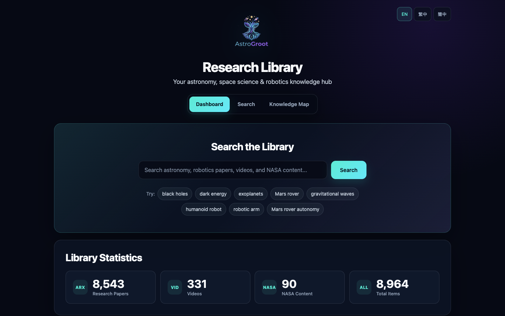
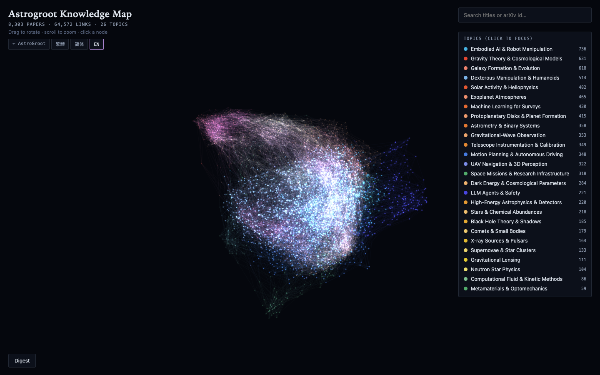
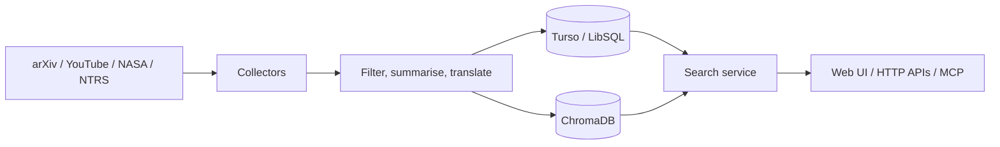

<div align="center">
  

# AstroGroot

**Turn scattered astronomy, aerospace, and robotics research into a searchable open library.**

[繁體中文](README.md) · [English](README.en.md)

[](https://deno.com/)
[](https://hono.dev/)
[](LICENSE)

[Live library](https://astrogroot.org/?lang=en) ·
[Knowledge map](https://astrogroot.org/map?lang=en) ·
[TokimiSpace open-source hub](https://tokimispace.github.io/?lang=en) ·
[Tokimi website](https://tokimi.space)

</div>

AstroGroot is built with Deno, Hono, Turso, and ChromaDB. It includes collectors for arXiv, YouTube, NASA, and the NASA Technical Reports Server (NTRS), plus a trilingual website, search APIs, a knowledge map, and an MCP interface.

> [!IMPORTANT]
> AI-generated summaries and translations are reading aids. Verify research, engineering, and safety decisions against the linked original sources.



## Main features

| Capability       | Current implementation                                                                |
| ---------------- | ------------------------------------------------------------------------------------- |
| Research search  | Keywords, type, date, and pagination; vector search falls back to FTS5/keyword search |
| Multiple sources | arXiv papers, YouTube educational videos, NASA media, and NTRS technical reports      |
| Trilingual UI    | `?lang=en`, `?lang=zh-TW`, and `?lang=zh-CN`                                          |
| Knowledge map    | Explore the collection through topics and relationships                               |
| Developer access | `/api/search`, `/api/stats`, and JSON-RPC 2.0 `/api/mcp`                              |



## Architecture



The Anthropic API provides summaries and translations. Its daily budget mechanism is a best-effort guard; one item may overshoot it. MCP exposes three read-only tools: `search`, `get_stats`, and `get_detail`.

## Quick start

You need [Deno 2](https://docs.deno.com/runtime/getting_started/installation/), Docker Compose, and a Turso database. Running collectors also needs an Anthropic API key; the YouTube collector needs a YouTube Data API key.

```bash
git clone https://github.com/topben/astrogroot.git
cd astrogroot
cp .env.example .env
```

Edit `.env` and configure at least Turso. ChromaDB uses `8000` by default, so the local web app can use `8001`:

```env
TURSO_DATABASE_URL=libsql://your-database.turso.io
TURSO_AUTH_TOKEN=replace-with-your-token
CHROMA_HOST=http://localhost:8000
CHROMA_AUTH_TOKEN=replace-with-a-local-token
PORT=8001
```

```bash
docker compose up -d
deno task db:push
deno task dev
```

Open <http://localhost:8001/?lang=en>. A new database stays empty until a collector runs. Never commit `.env` or credentials.

### Collect data (optional)

After adding source and AI credentials, run:

```bash
deno task worker
```

Source APIs, AI processing, and vector storage may cost money. Start with the small batch in `.env.example` and monitor provider billing directly.

## Development

| Command                     | Purpose                      |
| --------------------------- | ---------------------------- |
| `deno task dev`             | Start the development server |
| `deno task test`            | Run tests                    |
| `deno task worker`          | Collect and index one batch  |
| `deno task rebuild-vectors` | Rebuild vector indexes       |

Search example:

```bash
curl "http://localhost:8001/api/search?q=space+robotics&type=papers&lang=en&limit=5"
```

See the [deployment guide](docs/DEPLOYMENT.md) for Deno Deploy, Turso, Fly.io, and ChromaDB setup. These are documented deployment paths, not a claim that the project operates every service continuously.

## Data and licence boundaries

- Code in this repository is available under the [MIT License](LICENSE).
- Papers, videos, images, source abstracts, and metadata remain subject to each provider's licence and terms. MIT does not relicense third-party content.
- `static/rocket-exam.html` claims to use an official 55-question bank, but the repository does not yet include verifiable source and reuse-rights records. Until that is resolved, do not treat MIT as permission to reuse or republish the question content.
- Do not send private or regulated data through collection or AI processing. Self-hosters are responsible for secrets, logs, retention, and provider terms.
- Live collection counts change; README screenshots illustrate the interface and are not fixed data snapshots.

Reproducible reports are welcome in [GitHub Issues](https://github.com/topben/astrogroot/issues). Before submitting a change, run:

```bash
deno fmt --check
deno lint
deno task test
```
