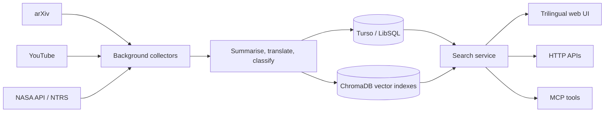

<div align="center">
  

# AstroGroot

**Turn scattered astronomy, aerospace, and robotics research into a searchable open library.**

[繁體中文](README.md) · [English](README.en.md)

[](https://deno.com/)
[](https://hono.dev/)
[](#what-you-can-do)
[](LICENSE)

[Live library](https://astrogroot.org/?lang=en) ·
[Knowledge map](https://astrogroot.org/map?lang=en) ·
[TokimiSpace open-source hub](https://tokimispace.github.io/?lang=en) ·
[Tokimi website](https://tokimi.space)

</div>

AstroGroot is a research-library platform built with Deno, Hono, Turso, and ChromaDB. Its worker collects material from arXiv, YouTube, NASA, and the NASA Technical Reports Server (NTRS), then creates summaries, translations, and search indexes. People can explore the library through a trilingual website, HTTP APIs, or MCP tools.

> [!IMPORTANT]
> AI-generated summaries and translations are reading aids, not substitutes for the original sources. Verify every research, engineering, or safety decision against the linked source material.


## What you can do

| Capability                  | How you use it                                                                | Current implementation                                              |
| --------------------------- | ----------------------------------------------------------------------------- | ------------------------------------------------------------------- |
| Search research material    | Filter by keywords, content type, date, and page                              | Vector search with FTS5 and keyword fallbacks                       |
| Browse multiple sources     | Papers, educational videos, NASA media, and technical reports                 | arXiv, YouTube, NASA API, and NASA NTRS collectors                  |
| Change reading language     | `?lang=en`, `?lang=zh-TW`, or `?lang=zh-CN`                                   | English, Traditional Chinese, and Simplified Chinese UI and indexes |
| Explore the knowledge map   | [Open the interactive map](https://astrogroot.org/map?lang=en)                | Topics and relationships across the collection                      |
| Connect other tools         | `/api/search`, `/api/stats`, and `/api/mcp`                                   | HTTP APIs and a JSON-RPC 2.0 MCP endpoint                           |
| Practise rocket regulations | [Rocket launch licence mock exam](https://astrogroot.org/rocket-exam?lang=en) | Timed questions and a study guide                                   |


## How it works



- Hono JSX renders the web application on the server; `main.tsx` is its main entry point.
- Turso/LibSQL stores the collection, translations, and full-text indexes. ChromaDB stores a vector collection for each language.
- Collectors filter off-topic material, then use the Anthropic API for summaries and translations. An environment variable can enforce a daily AI-spend ceiling.
- MCP currently exposes three read-only tools: `search`, `get_stats`, and `get_detail`.

## Five-minute setup

### Prerequisites

- [Deno 2](https://docs.deno.com/runtime/getting_started/installation/)
- [Docker Desktop](https://docs.docker.com/get-docker/) or Docker Engine with Compose
- A [Turso](https://turso.tech/) database
- To run collectors: an Anthropic API key; YouTube collection also needs a YouTube Data API key

### 1. Clone and configure

```bash
git clone https://github.com/topben/astrogroot.git
cd astrogroot
cp .env.example .env
```

Edit `.env` and provide at least the Turso connection. ChromaDB uses port `8000` by default, so use `8001` for the local web app:

```env
TURSO_DATABASE_URL=libsql://your-database.turso.io
TURSO_AUTH_TOKEN=replace-with-your-token
CHROMA_HOST=http://localhost:8000
CHROMA_AUTH_TOKEN=replace-with-a-local-token
PORT=8001
```

Never commit `.env`, API keys, or database tokens.

### 2. Start services and create tables

```bash
docker compose up -d
deno task db:push
deno task dev
```

Open <http://localhost:8001/?lang=en>, or check the service directly:

```bash
curl http://localhost:8001/api/health
```

An empty library is expected until you run a collector.

### 3. Collect data (optional)

Set `ANTHROPIC_API_KEY` and the credentials for the sources you need, then run:

```bash
deno task worker
```

Source APIs, AI processing, and vector storage may cost money. Start with the small batch size and daily budget ceiling provided in `.env.example`.

## API and MCP examples

Search API:

```bash
curl "http://localhost:8001/api/search?q=space+robotics&type=papers&lang=en&limit=5"
```

List the MCP tools:

```bash
curl -X POST http://localhost:8001/api/mcp \
  -H "Content-Type: application/json" \
  -d '{
    "jsonrpc": "2.0",
    "id": 1,
    "method": "tools/list"
  }'
```

The MCP endpoint includes request-size, timeout, and rate-limit protections. A public deployment should still configure `MCP_ALLOWED_ORIGINS`, network boundaries, and server-side monitoring for its own threat model.

## Common commands

| Command                     | Purpose                                         |
| --------------------------- | ----------------------------------------------- |
| `deno task dev`             | Start the development server with file watching |
| `deno task test`            | Run unit tests                                  |
| `deno task worker`          | Collect and index one batch of data             |
| `deno task db:generate`     | Generate a Drizzle migration                    |
| `deno task db:push`         | Apply the schema to Turso                       |
| `deno task rebuild-vectors` | Rebuild vector indexes                          |
| `deno task reindex-all`     | Re-index all content                            |

## Repository map

```text
astrogroot/
├── main.tsx              # Web, API, and MCP routes
├── components/           # Hono JSX pages and components
├── lib/
│   ├── ai/               # Summaries, translations, and usage limits
│   ├── collectors/       # arXiv, YouTube, NASA, and NTRS
│   ├── search.ts         # Vector, full-text, and keyword search
│   ├── vector.ts         # ChromaDB collections
│   └── mcp.ts            # MCP JSON-RPC tools
├── db/                   # Drizzle schema and Turso client
├── workers/crawler.ts    # Background collector
├── locales/              # en, zh-TW, and zh-CN dictionaries
├── static/               # Web assets
└── docs/DEPLOYMENT.md    # Full deployment guide
```

## Data, privacy, and licence boundaries

- Code in this repository is available under the [MIT License](LICENSE).
- Indexed papers, videos, images, source abstracts, and metadata remain subject to each provider's licence and terms. The MIT licence does not relicense third-party content.
- Do not send private or regulated data through the collection or AI-processing pipeline. Self-hosters are responsible for secrets, logs, retention, and provider terms.
- Live collection counts change over time. README screenshots illustrate the interface; they are not fixed data snapshots.

## Deployment, contributions, and support

See the [deployment guide](docs/DEPLOYMENT.md) for the full Deno Deploy, Turso, Fly.io, and ChromaDB setup.

Reproducible bug reports are welcome in [GitHub Issues](https://github.com/topben/astrogroot/issues). Please open an issue before a large feature change, and run these checks before submitting a pull request:

```bash
deno fmt --check
deno lint
deno task test
```

Try [the live library](https://astrogroot.org/?lang=en), or visit [TokimiSpace](https://tokimispace.github.io/?lang=en) to discover the other open-source projects.
