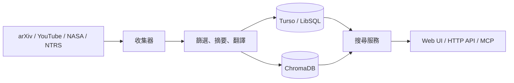

<div align="center">
  

# AstroGroot

**把分散的天文、航太與機器人研究資料，整理成可搜尋的開放圖書館。**

[繁體中文](README.md) · [English](README.en.md)

[](https://deno.com/)
[](https://hono.dev/)
[](LICENSE)

[線上圖書館](https://astrogroot.org/?lang=zh-TW) ·
[知識圖](https://astrogroot.org/map?lang=zh-TW) ·
[TokimiSpace 開源首頁](https://tokimispace.github.io/?lang=zh-TW) ·
[Tokimi 官方網站](https://tokimi.space)

</div>

> [!WARNING]
> **防詐騙：任何以 `@gmail.com` 結尾、並自稱 Tokimi 的帳號，都不是 Tokimi 官方聯絡管道。** 請勿付款或提供驗證碼；只透過 [Tokimi 官方網站](https://tokimi.space/) 或 [ben@tokimi.space](mailto:ben@tokimi.space) 核實身分。

AstroGroot 以 Deno、Hono、Turso 與 ChromaDB 建構。程式包含 arXiv、YouTube、NASA 與 NASA Technical Reports Server（NTRS）收集器，以及三語網頁、搜尋 API、知識圖與 MCP 介面。

> [!IMPORTANT]
> AI 摘要與翻譯只供閱讀輔助。研究、工程或安全決策前，請回到每筆資料的原始來源核對。


## 主要功能

| 功能         | 目前實作                                                    |
| ------------ | ----------------------------------------------------------- |
| 研究資料搜尋 | 關鍵字、類型、日期與分頁；向量搜尋可降級至 FTS5／關鍵字搜尋 |
| 多來源收集   | arXiv 論文、YouTube 教育影片、NASA 圖像與 NTRS 技術報告     |
| 三語介面     | `?lang=en`、`?lang=zh-TW`、`?lang=zh-CN`                    |
| 知識圖       | 以主題與關聯探索館藏                                        |
| 開發者介面   | `/api/search`、`/api/stats`、JSON-RPC 2.0 `/api/mcp`        |


## 架構



Anthropic API 用於摘要與翻譯。每日預算機制是 best-effort guard，單筆處理仍可能超額。MCP 提供 `search`、`get_stats`、`get_detail` 三個唯讀工具。

## 快速開始

需要 [Deno 2](https://docs.deno.com/runtime/getting_started/installation/)、Docker Compose、Turso 資料庫；執行收集器時另需 Anthropic API key，YouTube 收集器還需要 YouTube Data API key。

```bash
git clone https://github.com/topben/astrogroot.git
cd astrogroot
cp .env.example .env
```

編輯 `.env`，至少設定 Turso。ChromaDB 預設使用 `8000`，本機 Web 可改用 `8001`：

```env
TURSO_DATABASE_URL=libsql://your-database.turso.io
TURSO_AUTH_TOKEN=replace-with-your-token
CHROMA_HOST=http://localhost:8000
CHROMA_AUTH_TOKEN=replace-with-a-local-token
PORT=8001
```

```bash
docker compose up -d
deno task db:push
deno task dev
```

開啟 <http://localhost:8001/?lang=zh-TW>。新資料庫在執行收集器前是空的；請勿提交 `.env` 或任何憑證。

### 收集資料（選用）

設定來源與 AI 憑證後執行：

```bash
deno task worker
```

來源 API、AI 處理與向量儲存可能產生費用；請從 `.env.example` 的小批次開始，並直接監控供應商帳務。

## 開發

| 指令                        | 用途               |
| --------------------------- | ------------------ |
| `deno task dev`             | 啟動開發伺服器     |
| `deno task test`            | 執行測試           |
| `deno task worker`          | 收集並索引一批資料 |
| `deno task rebuild-vectors` | 重建向量索引       |

搜尋範例：

```bash
curl "http://localhost:8001/api/search?q=space+robotics&type=papers&lang=zh-TW&limit=5"
```

完整的 Deno Deploy、Turso、Fly.io 與 ChromaDB 設定請見[部署指南](docs/DEPLOYMENT.md)。這些是文件記載的部署流程，不代表每個服務都由專案方持續營運。

## 資料與授權邊界

- 本 repository 的程式碼採 [MIT License](LICENSE)。
- 論文、影片、圖片、來源摘要與 metadata 仍受各提供者的授權與條款約束；MIT 不會重新授權第三方內容。
- `static/rocket-exam.html` 聲稱使用官方 55 題題庫，但 repository 尚未附可驗證的來源與再利用權利紀錄；在補齊前，請勿把 MIT 視為題庫內容的授權或轉載依據。
- 請勿將私密或受管制資料送入收集或 AI 流程。自行部署者需管理憑證、日誌、資料保留與供應商條款。
- 線上館藏會變動；README 截圖只用來說明介面，不是固定資料快照。

歡迎透過 [GitHub Issues](https://github.com/topben/astrogroot/issues) 回報可重現的問題。提交前請執行：

```bash
deno fmt --check
deno lint
deno task test
```
