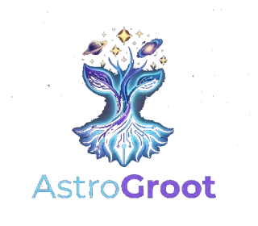
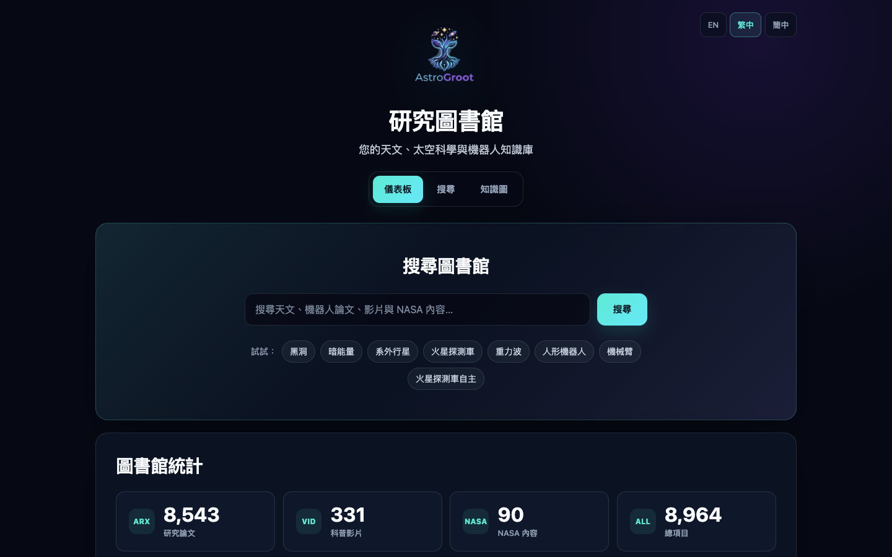
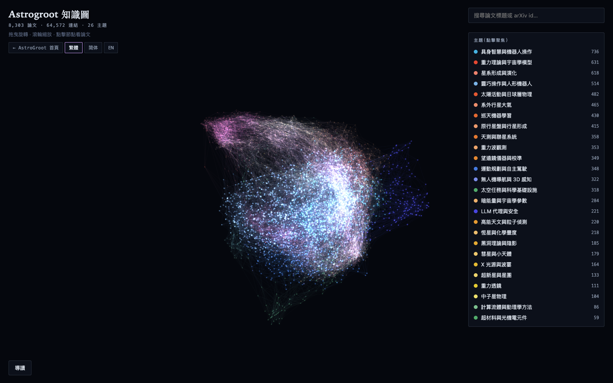
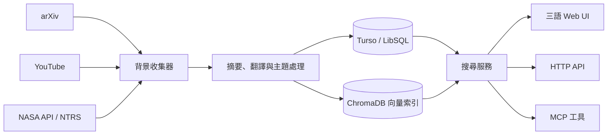

<div align="center">
  

# AstroGroot

**把分散的天文、航太與機器人研究資料，整理成可搜尋的開放圖書館。**

[繁體中文](README.md) · [English](README.en.md)

[](https://deno.com/)
[](https://hono.dev/)
[](#你可以做什麼)
[](LICENSE)

[線上圖書館](https://astrogroot.org/?lang=zh-TW) ·
[知識圖](https://astrogroot.org/map?lang=zh-TW) ·
[TokimiSpace 開源首頁](https://tokimispace.github.io/?lang=zh-TW) ·
[Tokimi 官方網站](https://tokimi.space)

</div>

AstroGroot 是一套以 Deno、Hono、Turso 與 ChromaDB 建構的研究資料平台。背景工作會從
arXiv、YouTube、NASA 與 NASA Technical Reports Server（NTRS）收集資料，再產生摘要、翻譯與搜尋索引；
使用者可透過三語網頁、HTTP API 或 MCP 工具探索內容。

> [!IMPORTANT]
> AI 摘要與翻譯是閱讀輔助，不是原始資料的替代品。研究、工程或安全決策前，請回到每筆項目的來源連結核對。



## 你可以做什麼

| 功能         | 使用方式                                                              | 目前實作                                    |
| ------------ | --------------------------------------------------------------------- | ------------------------------------------- |
| 搜尋研究資料 | 關鍵字、內容類型、日期與分頁篩選                                      | 向量搜尋，並以 FTS5／關鍵字搜尋作為降級路徑 |
| 瀏覽多種來源 | 論文、教育影片、NASA 圖像與技術報告                                   | arXiv、YouTube、NASA API、NASA NTRS 收集器  |
| 切換閱讀語言 | `?lang=en`、`?lang=zh-TW`、`?lang=zh-CN`                              | 英文、繁體中文、簡體中文介面與內容索引      |
| 探索知識圖   | [開啟互動知識圖](https://astrogroot.org/map?lang=zh-TW)               | 以主題與關聯呈現館藏結構                    |
| 串接其他工具 | `/api/search`、`/api/stats`、`/api/mcp`                               | HTTP API 與 JSON-RPC 2.0 MCP endpoint       |
| 練習火箭法規 | [火箭發射執照模擬測驗](https://astrogroot.org/rocket-exam?lang=zh-TW) | 計時測驗與讀書指南                          |



## 系統如何運作



- Web 層由 Hono JSX 伺服器端渲染，主要入口是 `main.tsx`。
- Turso／LibSQL 保存館藏、翻譯與全文索引；ChromaDB 保存各語言的向量集合。
- 收集器會過濾離題內容，再使用 Anthropic API 產生摘要與翻譯；每日 AI 預算可由環境變數限制。
- MCP 目前提供 `search`、`get_stats`、`get_detail` 三個唯讀工具。

## 五分鐘啟動

### 需要準備

- [Deno 2](https://docs.deno.com/runtime/getting_started/installation/)
- [Docker Desktop](https://docs.docker.com/get-docker/) 或 Docker Engine + Compose
- 一個 [Turso](https://turso.tech/) 資料庫
- 若要執行收集器：Anthropic API key；收集 YouTube 時另需 YouTube Data API key

### 1. 下載並設定

```bash
git clone https://github.com/topben/astrogroot.git
cd astrogroot
cp .env.example .env
```

編輯 `.env`，至少填入 Turso 連線資訊。由於 ChromaDB 預設使用 `8000`，本機 Web 建議改用 `8001`：

```env
TURSO_DATABASE_URL=libsql://your-database.turso.io
TURSO_AUTH_TOKEN=replace-with-your-token
CHROMA_HOST=http://localhost:8000
CHROMA_AUTH_TOKEN=replace-with-a-local-token
PORT=8001
```

不要提交 `.env`、API key 或資料庫 token。

### 2. 啟動服務與資料表

```bash
docker compose up -d
deno task db:push
deno task dev
```

打開 <http://localhost:8001/?lang=zh-TW>，或確認健康檢查：

```bash
curl http://localhost:8001/api/health
```

看到空的館藏統計是正常的；執行收集器後才會出現資料。

### 3. 收集資料（選用）

先在 `.env` 設定 `ANTHROPIC_API_KEY` 與需要的來源憑證，再執行：

```bash
deno task worker
```

來源 API、AI 處理與向量寫入可能產生成本。建議先保留 `.env.example` 的小批次與每日預算上限設定。

## API 與 MCP 範例

搜尋 API：

```bash
curl "http://localhost:8001/api/search?q=space+robotics&type=papers&lang=zh-TW&limit=5"
```

列出 MCP 工具：

```bash
curl -X POST http://localhost:8001/api/mcp \
  -H "Content-Type: application/json" \
  -d '{
    "jsonrpc": "2.0",
    "id": 1,
    "method": "tools/list"
  }'
```

MCP endpoint 預設有 body size、逾時與 rate-limit 保護；公開部署前仍應設定合適的
`MCP_ALLOWED_ORIGINS`、網路邊界與服務端監控。

## 常用指令

| 指令                        | 用途                     |
| --------------------------- | ------------------------ |
| `deno task dev`             | 啟動開發伺服器並監看檔案 |
| `deno task test`            | 執行單元測試             |
| `deno task worker`          | 單次執行資料收集與索引   |
| `deno task db:generate`     | 產生 Drizzle migration   |
| `deno task db:push`         | 將 schema 套用到 Turso   |
| `deno task rebuild-vectors` | 重建向量索引             |
| `deno task reindex-all`     | 重建全部內容索引         |

## 專案地圖

```text
astrogroot/
├── main.tsx              # Web、API、MCP 路由
├── components/           # Hono JSX 頁面與元件
├── lib/
│   ├── ai/               # 摘要、翻譯與用量控制
│   ├── collectors/       # arXiv、YouTube、NASA、NTRS
│   ├── search.ts         # 向量／全文／關鍵字搜尋
│   ├── vector.ts         # ChromaDB 集合
│   └── mcp.ts            # MCP JSON-RPC 工具
├── db/                   # Drizzle schema 與 Turso client
├── workers/crawler.ts    # 背景收集器
├── locales/              # en、zh-TW、zh-CN 字典
├── static/               # 網站靜態資產
└── docs/DEPLOYMENT.md    # 完整部署指南
```

## 資料、隱私與授權邊界

- 本 repository 的程式碼以 [MIT License](LICENSE) 授權。
- 被索引的論文、影片、圖片、摘要原文與 metadata 仍受各來源的授權與使用條款約束；MIT 授權不會改變第三方內容的權利歸屬。
- 請勿將私密或受管制資料送入收集／AI 處理流程。自行部署者需負責憑證、日誌、資料保留與供應商條款。
- 線上館藏數量會持續變動，README 的畫面僅用來說明介面，不代表固定資料快照。

## 部署、貢獻與支援

完整的 Deno Deploy、Turso、Fly.io 與 ChromaDB 操作請見 [部署指南](docs/DEPLOYMENT.md)。

歡迎透過 [GitHub Issues](https://github.com/topben/astrogroot/issues) 回報可重現的問題，或先開 issue 討論較大的功能變更。提交前請執行：

```bash
deno fmt --check
deno lint
deno task test
```

如果 AstroGroot 對你有幫助，也可以到 [線上網站](https://astrogroot.org/?lang=zh-TW) 實際使用，或前往
[TokimiSpace](https://tokimispace.github.io/?lang=zh-TW) 探索其他開源專案。
